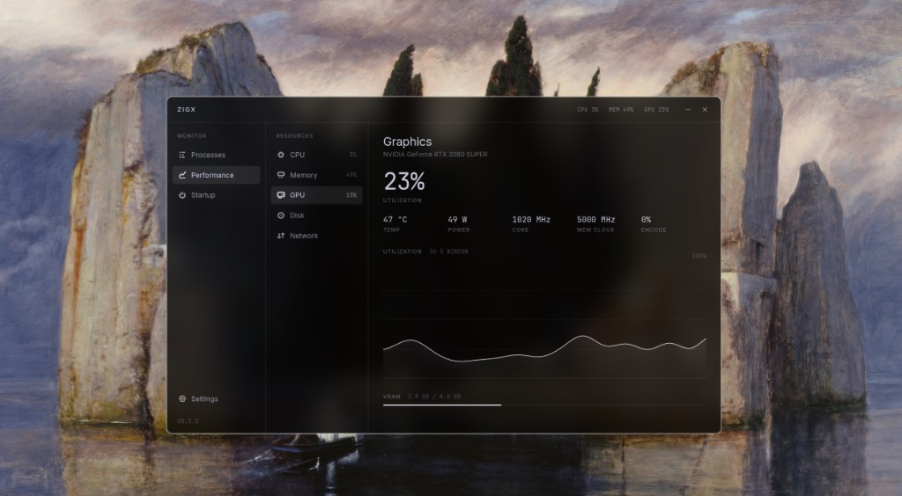

# ZIGX

A fast Linux system monitor. Processes, a per-core CPU grid, memory, GPU, disk, network, and startup apps — spectral white ink on black glass.



The window is transparent. On Hyprland and Omarchy the blur behind it is the glass. ZIGX does not paint a fake frost and it does not use a widget toolkit.

The visual system is monochrome and flat: one ink stepped by alpha, hairlines instead of shadows, tracked uppercase labels for structure, a monospace face for every number, and a single smoked pill, a faint wash with a fine bright edge, for the active choice. Chroma appears only as status, amber at 70 percent load and red at 90.

```bash
cargo run --release
```

Design system, layout, components, and motion are documented in [docs/design](docs/design/README.md).

## Install

```bash
cargo install --path .
install -Dm644 share/zigx.desktop ~/.local/share/applications/zigx.desktop
```

The desktop entry expects `zigx` on `PATH`; `~/.cargo/bin` is the default install location.

## Using it

Sampling runs off the UI thread and the window redraws when numbers change, not on a busy loop. The nav footer shows how long the last sample took.

Press `?` or `F1` (or click Keys at the foot of the nav) for a sheet of every shortcut, with the page you are on listed first. `Esc` closes it.

Keys, when the search box is not focused:

- `1` `2` `3` `4` switch pages (Processes, Performance, Startup, Settings). `Ctrl+,` opens Settings.
- On Performance, `c` `m` `g` `d` `n` select CPU, memory, GPU, disk, and network; Left and Right cycle those sections; `Space` pauses or resumes sampling.
- On Processes, Up and Down move focus through group headers and process rows (Shift extends the selection, Ctrl moves focus without changing it). Past the last row a fresh press wraps to the top, and past the first it wraps to the bottom; holding the key stops at the end. Startup and Settings wrap the same way. Home and End jump to the ends. Left and Right collapse or expand the focused group. `v` cycles the list view. `Ctrl+A` selects every visible process. `Ctrl+Space` toggles the focused process in the selection.
- Hold `Space` on Processes to freeze the list in the order on screen (or toggle a focused group header). Counts keep updating in place; letting go sorts again. Space still types into search while that field is focused.
- Search takes keys only while its field is focused. Click it, or press `Ctrl+F`. `Esc` clears it, `Ctrl+Backspace` empties it. Esc with an empty unfocused search clears the selection.
- Click selects a process; `Ctrl` and `Shift` extend the selection.
- Right-click a process for its menu, or press Shift+F10 / the Menu key: End task, Force kill (click twice), Suspend or Resume, Open file location, Copy command line, and Copy PID. It acts on the whole selection when the row is part of it. Arrow keys and `Enter` drive it, `Esc` closes it. Copying uses `wl-copy` (or `xclip` / `xsel`).
- `Delete` arms End task and a second press (or `Enter`) sends SIGTERM. Turn off Confirm ending in Settings to skip the second press.
- On Startup, Up and Down focus an entry; Space or Enter toggles it.
- On Settings, Up and Down focus a row; Left and Right cycle choices, chips, and zoom; Space or Enter toggles switches or activates Reset.
- `PageUp` `PageDown` scroll the current page.

### Settings

The Settings page, at the foot of the nav, applies every change at once and saves it to `~/.config/zigx/settings.txt`, which is also safe to edit by hand.

- **Appearance:** interface scale, glass (clear, glass, solid), animations (on or off: fades, glides and transitions across the interface), graph motion (smooth or reduced), row density, status color, title bar readout.
- **Graphs:** history (30 s, 1 min, 2 min), curves (smooth or linear), fill under traces, grid.
- **Data:** update speed (0.5, 1 or 2 s, or Pause), process CPU as a share of one core or of the whole machine, byte units (1024 or 1000), temperature (°C or °F).
- **Processes:** which optional columns show (GPU, Disk, PID, User, Threads), and whether ending a task asks for a second click.
- **General:** the page ZIGX opens on, and Reset, which takes two clicks.

Pause lasts for the session only; ZIGX always launches live.

### Zoom

`Ctrl++` / `Ctrl+=` zooms in and `Ctrl+-` zooms out. Stops run from 80% to 180% (80, 90, 100, 110, 125, 140, 160, 180). `Ctrl+0` resets to 100%. Settings has the same control. The scale is saved in `~/.config/zigx/ui.txt` with the other remembered layout state.

Startup lists every `.desktop` in `/etc/xdg/autostart` (and `$XDG_CONFIG_DIRS`) merged with `~/.config/autostart`, where a user file overrides the system one of the same name, plus Omarchy/Hypr `o.launch_on_start(...)` lines from `~/.config/hypr/autostart.lua`. `OnlyShowIn` / `NotShowIn` / `TryExec` do not hide desktop entries from the list. Turning a desktop entry off writes `Hidden=true` into the user file (creating it from the system entry when needed) and keeps a one-time `.bak`. Turning a Hypr launch off comments that `o.launch_on_start` block in the Lua file.

## Fonts

ZIGX picks installed fonts in this order: Inter, Adwaita Sans, Cantarell, Noto Sans, Liberation Sans, DejaVu Sans for text, and JetBrains Mono (Nerd Font), Adwaita Mono, Cascadia Mono, Fira Code, Noto Sans Mono, Liberation Mono, DejaVu Sans Mono for numbers. Override with `ZIGX_SANS` and `ZIGX_MONO` set to an installed family name.

## Compositor

The Wayland app id is `zigx`. If the desktop blur does not pick the window up:

```
windowrule = blur on, match:class zigx
```

## License

Apache License 2.0. See [LICENSE](LICENSE).
